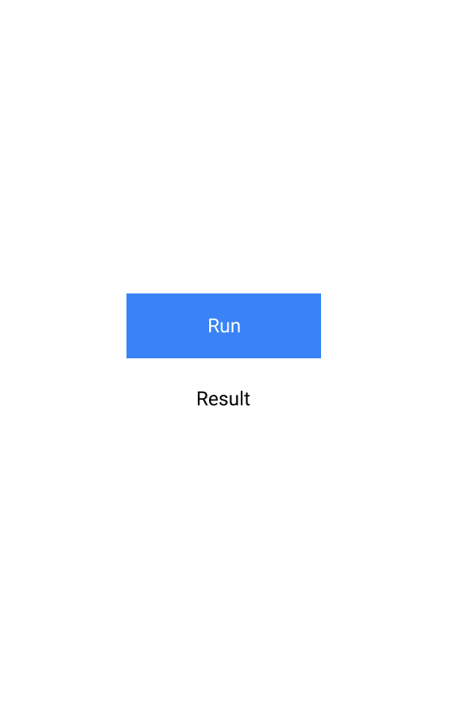
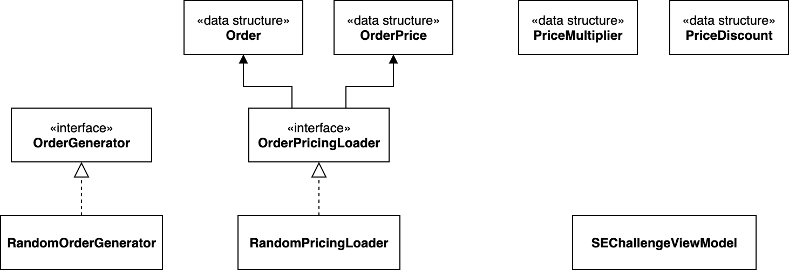

# SE1 Challenge

## Instructions
The challenge consists of many steps that represent business and non-business requirements. The concept of this challenge is based on computing the price of a given order and its related business rules and requirements, or non-business requirements as well. 

Fork this GitHub repository and once you are done create a pull request.

### Requirement 1: User Interface
User Interface is not essential to this challenge. However, let's keep it consistent.
Create an simple iOS/Android app with one screen that looks like this:



Use MVVM UI Design pattern and whatever binding technique that is convenient for you.
Name the ViewModel as `SEChallengeViewModel`. When you tap on the Run button it fires a method in the ViewModel and once the asynchronous operation is done it shows the result which is going to be just one number or when the error occurs show `Failure` text in the same Result label.

### Requirement 2: Core Service 
You are given predefined interface and predefined implementation of that interface. You cannot change anything in the interface or the given implementation.

Kotlin
```kotlin
data class Order(val id: String)
data class OrderPrice(val price: Double)

interface OrderPricingLoader {
    fun load(order: Order, completion: (result: Result<OrderPrice>) -> Unit)
}
```
Swift
```swift
struct Order {
    let id: String
}
struct OrderPrice {
    let price: Double
}
protocol OrderPricingLoader {
    func load(order: Order, completion: @escaping (Result<OrderPrice, Error>) -> Void)
}
```
The interface is called `OrderPricingLoader` and has only one method that takes `Order` as an input parameter and completion parameter which is an asynchronous callback that is implemented as Closure(Swift)/Lambda(Kotlin). The callback has one parameter which is `Result`. On success it returns `OrderPrice` on failure it returns a generic error. 

`Order` is a simple structure/data class that has one parameter `id`.
`OrderPrice` is a simple structure/data class that has one parameter `price`.

Default implementation that is given for you looks like this:

Kotlin
```kotlin
import kotlin.random.Random
import kotlinx.coroutines.*

class OrderPricingLoaderException(message: String): Exception(message)

class RandomOrderPricingLoader : OrderPricingLoader {
    override fun load(order: Order, completion: (result: Result<OrderPrice>) -> Unit) {
        performOnBackground {
            if (isFailure()) {
                completion(Result.failure(getPricingException()))
            } else {
                completion(Result.success(getRandomOrderPrice()))
            }
        }
    }
    
    private fun performOnBackground(action: () -> Unit) = GlobalScope.launch { action () }
    private fun isFailure() = Random.nextBoolean()
    private fun getPricingException() = OrderPricingLoaderException(":(")
    private fun getRandomOrderPrice() = OrderPrice(getRandomPrice())
    private fun getRandomPrice() = Random.nextDouble(1000.0, 200000.0)
}
```
Swift
```swift
import Foundation

enum OrderPricingLoaderError: Error {
    case generic(String)
}

final class RandomOrderPricingLoader: OrderPricingLoader {
    func load(order: Order, completion: @escaping (Result<OrderPrice, Error>) -> Void) {
        performOnBackground { [weak self] in
            guard let self = self else { return }
            if (self.isFailure()) {
                completion(.failure(self.getPricingError()))
            } else {
                completion(.success(self.getRandomOrderPrice()))
            }
        }
    }

    private func performOnBackground(action: @escaping () -> Void) {
        DispatchQueue.global(qos: .background).async(execute: action)
    }
    private func isFailure() -> Bool { Bool.random() }
    private func getPricingError() -> Error { OrderPricingLoaderError.generic(":(") }
    private func getRandomOrderPrice() -> OrderPrice { OrderPrice(value: getRandomPrice()) }
    private func getRandomPrice() -> Double { Double.random(in: 1000.0 ..< 200000.0) }
}
```
### Requirement 3: Caching
Implement caching system. You should check if there is a cached price for a given `Order`. You should save returned `OrderPrice` on successful result. Implement InMemory caching system that means do not use SQLite or any other frameworks and libraries. 

### Requirement 4: Price Multiplier
When the price is returned from `OrderPricingLoader` you have to multiply it with a given coefficient.
Here is the structure/data class of that multiplier:

Kotlin
```kotlin
data class PriceMultiplier(val value: Double)
```
Swift
```swift
struct PriceMultiplier {
    let value: Double
}
```

When you implement this requirement, please bear in mind that you should get/load this structure/data class from somewhere, it should not be static but dynamic. It means you should introduce new abstraction (interface) to get/load that information.

### Requirement 5: Price Discount
When the price is returned from `OrderPricingLoader` and multiplied by Price multiplier you have to apply the discount if it satisfies given rules.
The business rule is that if an order price is greater than or equal to 100000.0 you should apply 30% discount.
Here is the structure/data class of that discount:

Kotlin
```kotlin
data class PriceDiscount(val value: Double)
```
Swift
```swift
struct PriceDiscount {
    let value: Double
}
```

When you implement this requirement, please bear in mind that you should get/load this structure/data class from somewhere, it should not be static but dynamic. It means you should introduce new abstraction (interface) to get/load that information.

### Requirement 6: Failure Repetition
When an failure is returned from `OrderPricingLoader` you have to try it one more time and when it fails again the whole operation fails.

### Requirement 7: Logging
You have to log returned price from `OrderPricingLoader`. The price must be logged before and after price multiplication requirement and before and after price discount requirement. Printing into a console is enough for this challenge do not implement any txt file or other logging mechanisms. Do not log anything if the price was returned from caching system.

Use this structure of the order price log:
`Order: ID. Price: XYZ`

When you implement this requirement, please bear in mind that you should introduce new abstraction (interface) for logger/logging system.

### Order Generator
Due to fact that this challenge is extracted from a real-life project and adjusted for teaching purposes, you are provided with Order Generator to simulate creating new orders. 

Kotlin
```kotlin
import kotlin.random.Random
import java.util.UUID

interface OrderGenerator {
    fun next() : Order
}

class RandomOrderGenerator(_probability: Double): OrderGenerator {
    private var last: Order
    private val probability: Double
    
    init {
        last = createNewOrder()
        probability = _probability
    }
    
    override fun next() : Order {
        if (shouldCreateNewOrder()) {
            last = createNewOrder()
        }
        return last
    }

    private fun shouldCreateNewOrder() = getRandomProbability() < probability
    private fun createNewOrder() = Order(UUID.randomUUID().toString())
    private fun getRandomProbability() = Random.nextDouble(0.0, 1.0)
}
```
Swift
```swift
import Foundation

protocol OrderGenerator {
    func next() -> Order
}

final class RandomOrderGenerator: OrderGenerator {
    private var last: Order!
    private let probability: Double

    init(probability: Double) {
        self.probability = probability
        last = createNewOrder()
    }

    func next() -> Order {
        if shouldCreateNewOrder() {
            last = createNewOrder()
        }
        return last
    }

    private func createNewOrder() -> Order { Order(id: UUID().uuidString) }
    private func shouldCreateNewOrder() -> Bool { getRandomProbability() < probability }
    private func getRandomProbability() -> Double { Double.random(in: 0.0 ... 1.0) }
}
```

You are given `RandomOrderGenerator` implementation. The generator creates new orders based on a given probability. When you set the `probability` to 1.0 it always creates new order when you call `next()`. On the contrary, when you set the `probability` to 0.0 it always returns the same order when you call `next()`.

### Summary & Restrictions
Implement all given requirements in the best possible way you can in terms of architectural design, design patterns, good practices, well known principles, OOP, and software engineering in general.
You cannot use any reactive technique (and frameworks). When you want to use asynchronous operation always implement it as a closure/lambda (the reason for this is to keep things simple and focuses on what really matters in this challenge).
Do not use any third-party libraries or frameworks. 
Do not use any dependency injection frameworks or libraries. Compose your solution manually. When you are injecting dependencies always use the Constructor Injection technique.
Implement the whole solution as a single module (monolith). Slicing (physical modularity) is not the main goal of this challenge.
When you introduce your own abstraction (interface) always implement it in the simple way, for example: InMemoryImplementation.
Your solution should be testable but do not write tests, again the tests are not main purpose of this challenge, thus it is not necessary.

Enjoy! :) 


### Diagram of Provided Components

